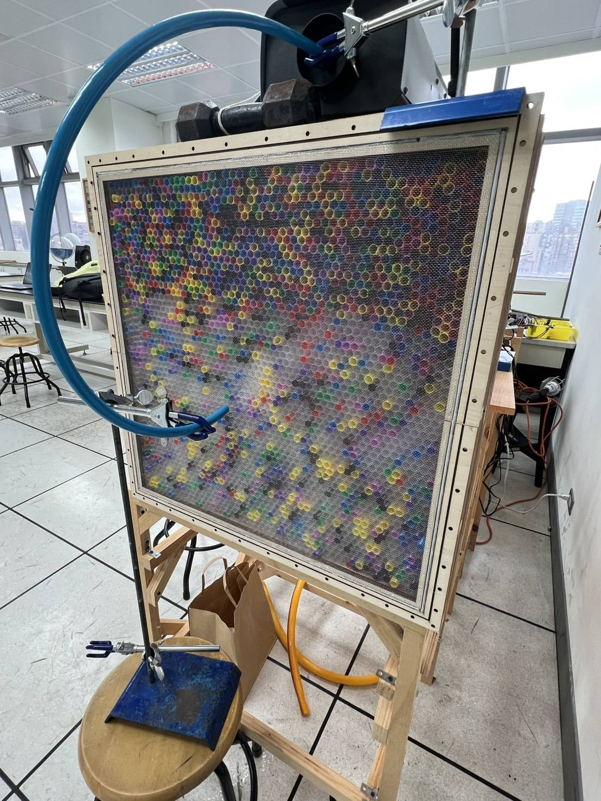

#Pictures

This gallery contains high-resolution photographs showcasing the physical assembly, structural components, measurement setup, and power system of the OpenWind modular wind tunnel.

---

## 🖼️ Modular Overview & Components

| Image | Component / Module | Description |
| :---: | :--- | :--- |
| **`Full_Windtunnel.jpg`** | **Full Assembly ** | Side view of the complete open-source modular wind tunnel system mounted on a wooden framework, showing the flow progression from intake to exhaust. |
| **`Straighten_Section.jpg`** | **Straightening Section ** | Front view of the intake module featuring the wooden casing, $10\text{ mm}$ drinking straw honeycomb array, fine wire mesh screen, and pressure sensing probe. |
| **`Convergent_Section.jpg`** | **Contraction Cone ** | Side profile of the 3D-printed orange contraction cone designed to accelerate air into the test section while minimizing turbulence. |
| **`Test_Section.jpg`** | **Test Section ** | Transparent acrylic working section equipped with lighting fixtures, measurement rulers, and test model mounting rigs. |
| **`Diffusion_Section.jpg`** | **Diffuser Section ** | Heavy-duty wooden expansion duct ($120\text{ cm}$ length, $2\text{ cm}$ wall thickness) designed for pressure recovery downstream of the test section. |
| **`Power_Section.jpg`** | **Power Section & Control ** | Rear exhaust module housing the $2 \times 2$ array of $20\text{ cm} \times 20\text{ cm}$ fans, connected to the PWM microcontroller control setup and data acquisition workstation. |

---

## 🛠️ Usage in Documentation

You can reference these images in your respective sub-module `README.md` files using standard Markdown syntax:

```markdown

